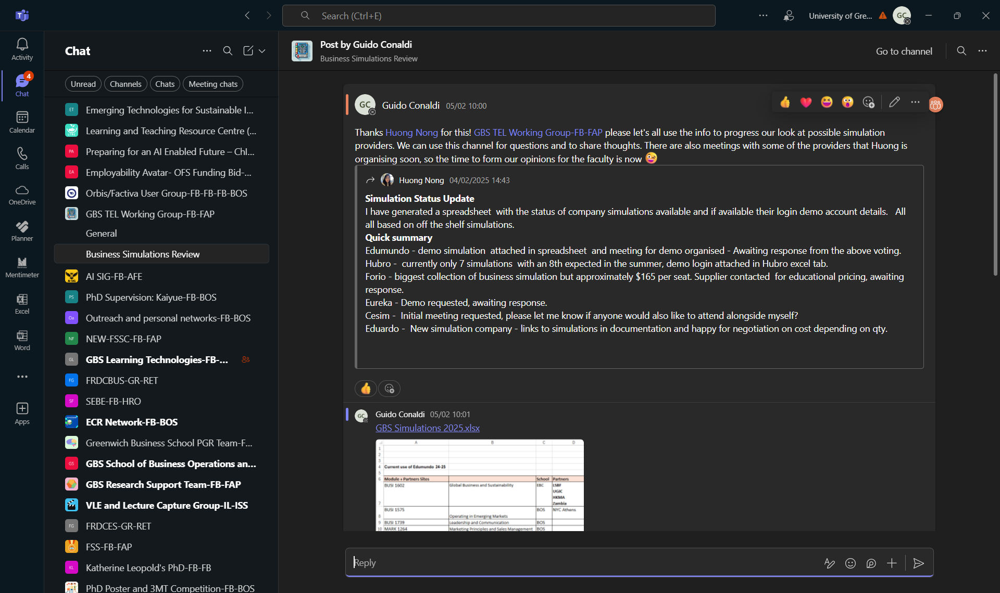
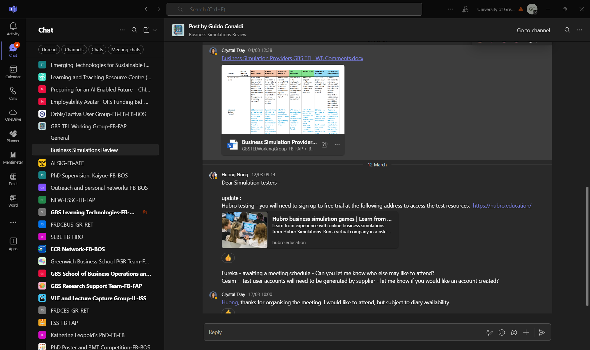

*This section demonstrates my understanding of how different technologies support learning within institutional constraints and resource limitations.*

## Description

My understanding of technological constraints and benefits is best demonstrated through leading the GBS TEL Working Group's comprehensive business simulation software review (2024-25). This process exemplifies systematic technology evaluation involving multiple stakeholders and addressing complex institutional needs.

The TEL Working Group, which I established in 2023 and chair, brings together academics from different schools within the faculty and learning technologists. To ensure effective governance, the working group and I drafted [Terms of Reference](/evidence/tel-working-group-terms/) that were subsequently approved by the Faculty Student Success Committee, providing clear mandate and accountability structures. Membership was determined through an open and competitive process—I advertised positions across the faculty, received Expressions of Interest from numerous academics demonstrating their TEL expertise and interests, and together with the GBS Associate Dean Student Success, selected members to ensure balanced representation across schools, disciplines, and levels of TEL experience. This diverse composition ensures we evaluate technologies from both pedagogical and technical perspectives.

Business simulations are essential to our experiential learning approach. With annual costs exceeding £100,000 affecting over 2,000 students annually, the review became critical at a time when UK universities face unprecedented pressure to reduce costs whilst maintaining educational quality. The challenge was to achieve significant savings without sacrificing the technological innovation essential to our pedagogical approach. Additional constraints with our current provider included limited partner institution access, lack of integration with our VLE, and absence of AI-supported feedback features.

I structured the review as a systematic process across multiple working group meetings from November 2024 onwards. The [Faculty Student Success Committee minutes from 24 January 2025](/evidence/fssc-minutes-24jan/) document how "the group carried on with the initiative to review business simulation software providers agreed at the previous meeting" and established clear actions including provider assignments and evaluation timelines. Initially, I conducted a wide scoping exercise with the Faculty Learning Technologies Manager to identify all potential providers in the market. We then narrowed this down to a shortlist of five viable options based on preliminary criteria before presenting to the working group. I also gathered feedback from colleagues outside the working group who currently use simulations in their teaching. This revealed significant variance in satisfaction—from highly positive experiences with certain features to frustrations with technical limitations. This feedback helped me understand what aspects of our current provision work well and must be maintained, versus what requires improvement through a new provider. I created a dedicated Teams channel within our working group space where I shared evaluation tables and gathered continuous feedback from members.

### Teams Channel Collaboration

The business simulation review utilised our dedicated Teams channel for ongoing collaboration and information sharing. This platform enabled continuous dialogue between formal meetings and provided a space for detailed technical discussions.

*Business Simulations Review Teams channel showing collaborative evaluation process with provider status updates and technical discussions. The channel enabled continuous dialogue between formal meetings.*

The evaluation involved five providers: our current provider, Cesim (offering AI-supported feedback), Harvard Business Publishing (128 simulations but requiring individual educator verification), Hubro (smaller company with 7 simulations), and Eureka. I assigned specific providers to different working group members based on their expertise and supported all evaluators by arranging demonstrations with provider representatives and coordinating demo access. Notably, Cesim proved the most responsive throughout this process, facilitating comprehensive demonstrations and providing detailed information promptly—a practical consideration that influenced our evaluation of their overall support capabilities.

*Comprehensive provider evaluation matrix and collaborative discussions developed through the TEL Working Group, comparing technical features, costs, pedagogical alignment, and implementation requirements across five potential providers.*

Each evaluator arranged demonstrations with provider representatives, tested the platforms, and assessed them against criteria we established: web-based accessibility, balance between customisation and ease of use, support for both experienced and new module leaders, pricing models (flat-fee versus per-student), partner institution compatibility, and VLE integration capabilities. Crucially, our evaluation emphasised balancing cost savings with pedagogical considerations, particularly ensuring that alternative providers' simulations aligned with current module learning outcomes. We discovered significant trade-offs—Cesim offered sophisticated AI-supported feedback and potential 50% cost reduction through their €50,000 cap, but lacked experience with Moodle integration.

Throughout this process, I managed the delicate challenge of involving module leaders in the evaluation whilst being mindful of raised expectations. Rather than broadly consulting all affected staff, I strategically gathered initial feedback from key users to understand current satisfaction levels and priorities. This measured approach allowed us to gather essential pedagogical input without creating pressure for immediate changes before the evaluation was complete. The [Faculty Student Success Committee minutes from 4 March 2025](/evidence/fssc-minutes-4march/) document how we "discussed the need to involve module leaders in the evaluation process while being mindful of raised expectations".

I documented our findings in detailed minutes which I presented at Faculty Student Success Committee meetings, ensuring that various school and faculty leads from both academic and professional services remained informed of our progress. This systematic approach enabled evidence-based decision-making, balancing pedagogical benefits against multiple practical constraints including budget limitations, diverse user needs, technical integration requirements, and the need to support our international partner institutions.

The review has led to concrete outcomes. The GBS Faculty finance team is now finalising the deal with Cesim for implementation in 2026-27. I am currently assembling a transition group bringing together all module leaders currently using or planning to use simulations with Cesim representatives. This group's primary purpose is to minimise implementation risks, particularly around Moodle integration which emerged as a critical concern during evaluation. By involving users early in the integration planning, we can ensure the specific simulations and technical requirements we need are properly addressed before the switch, maintaining the features colleagues value whilst enhancing areas identified for improvement.

## Reflection

Leading this review transformed my understanding of technology evaluation from focusing on features to managing complex stakeholder requirements within severe financial constraints. The UK higher education sector's financial pressures meant we needed to achieve substantial cost savings whilst enhancing rather than diminishing our technological capabilities—a seemingly paradoxical requirement that shaped every aspect of our evaluation.

My role in coordinating demonstrations and supporting evaluators revealed how operational constraints often outweigh technical advantages. The process taught me that successful technology leadership in the current climate requires finding solutions that deliver both innovation and efficiency.

The collaborative evaluation structure proved invaluable. By distributing provider reviews among working group members and facilitating their access to platforms, we not only managed workload but gained diverse perspectives. For instance, a colleague's testing revealed that Harvard's individual educator verification would create administrative barriers for our associate lecturers—a constraint that emerged through systematic testing.

Creating the Teams channel for ongoing feedback was particularly effective. Rather than limiting discussion to meetings, members could share insights as they tested platforms, leading to richer evaluation data. This approach has become my standard practice for complex technology decisions.

The most significant learning involved balancing competing constraints. Partner institution access emerged as non-negotiable—no matter how sophisticated a platform's features, excluding our international partners would undermine our institutional values. This reinforced that technology decisions must align with broader strategic objectives, not just immediate technical requirements.

The stakeholder management challenge of involving module leaders whilst avoiding unrealistic expectations taught me about the delicate timing required in technology transitions. Premature consultation risks creating pressure for change before alternatives are properly evaluated, whilst delayed involvement may miss crucial pedagogical insights. Finding this balance requires understanding both the political dynamics and the practical needs of different user groups.

Presenting to the Faculty Student Success Committee, with its diverse membership of school and faculty leads from both academic and professional services, required translating technical details into strategic implications. This experience improved my ability to communicate technology constraints and benefits to diverse audiences—essential for securing buy-in for significant changes.

## Evidence

**Primary Documentation:**
- [TEL Working Group Terms of Reference](/evidence/tel-working-group-terms/) - Formal governance structure and accountability framework
- [Faculty Student Success Committee Minutes - 24 January 2025](/evidence/fssc-minutes-24jan/) - Provider assignment and evaluation timeline
- [Faculty Student Success Committee Minutes - 4 March 2025](/evidence/fssc-minutes-4march/) - Evaluation outcomes and stakeholder management

**Collaborative Process:**
- Teams channel screenshots demonstrating continuous dialogue and information sharing
- Provider evaluation matrix showing systematic comparison framework
- Working group meeting minutes documenting systematic evaluation approach

**Technical Evaluation:**
- Provider demonstration attendance records
- Cost analysis comparing current expenditure with alternative options
- Technical integration assessment focusing on VLE compatibility
- Partner institution access evaluation ensuring international student inclusion

**Outcomes and Implementation:**
- Final recommendation documentation leading to Cesim selection
- Transition planning materials for 2026-27 implementation
- Risk mitigation strategies particularly addressing Moodle integration concerns

---

*Navigation: [← Contextual Statement](/contextual-statement/) | [Core Area 1b →](/core-area-1b/)*