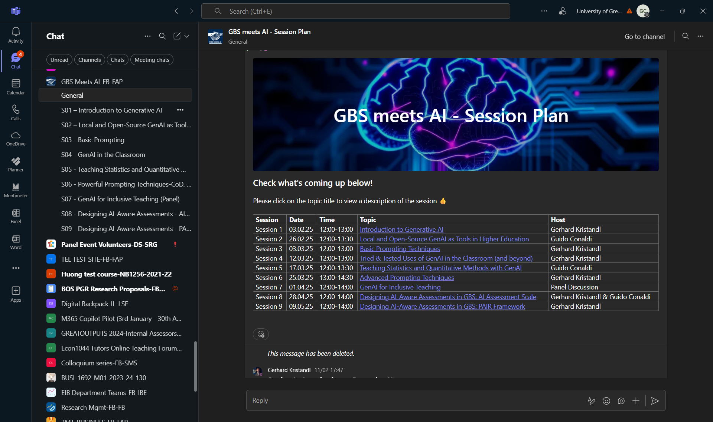
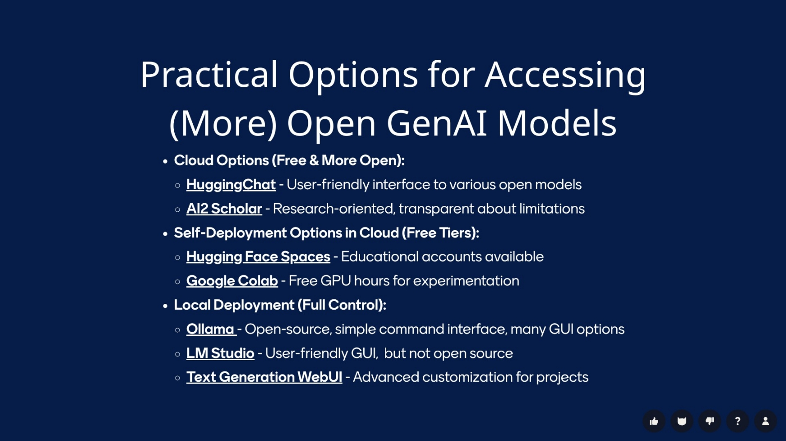
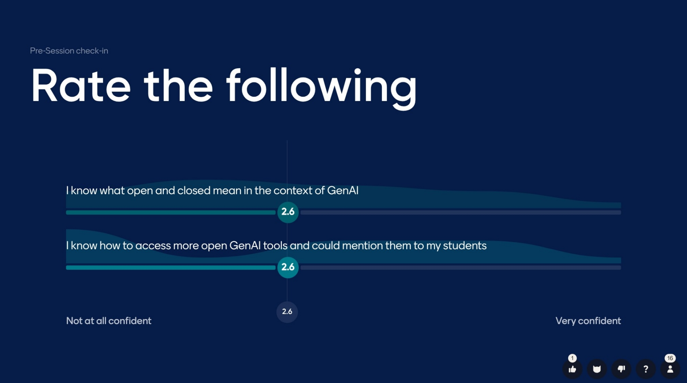
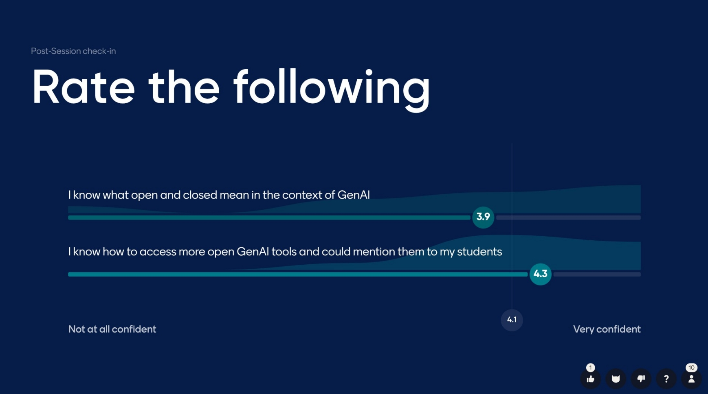
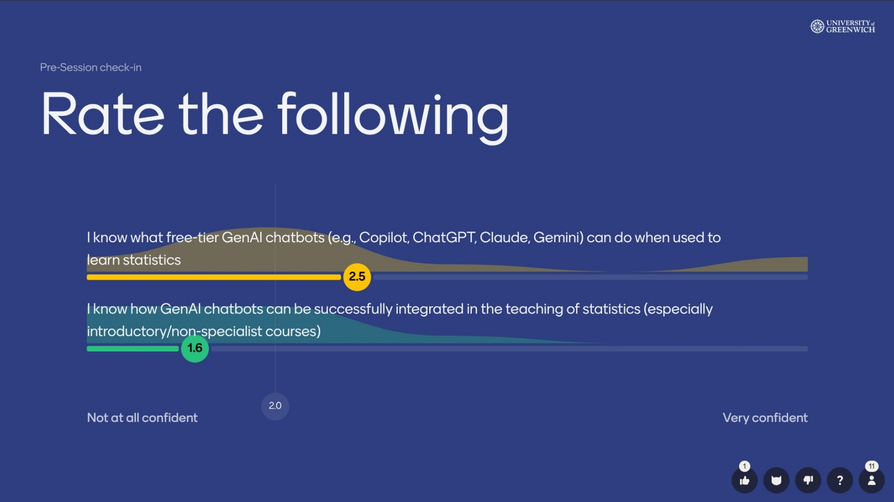
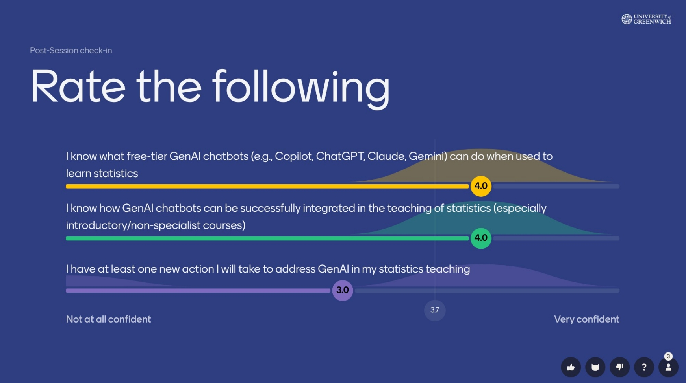
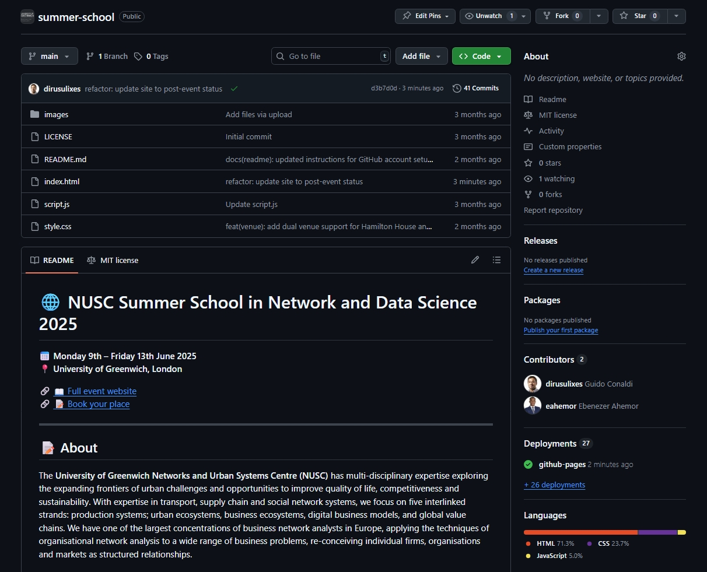
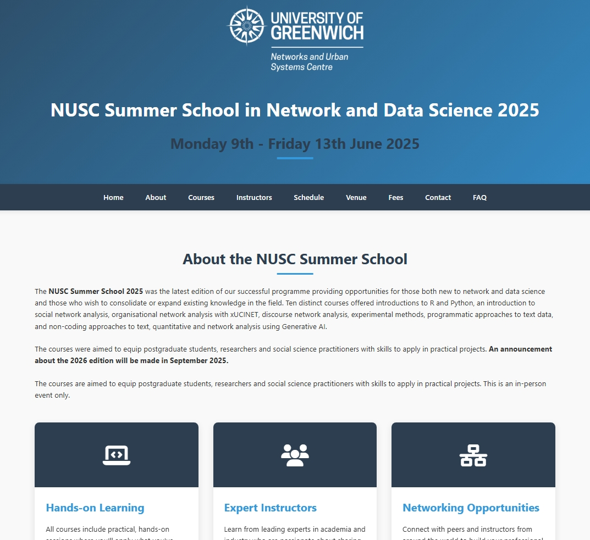
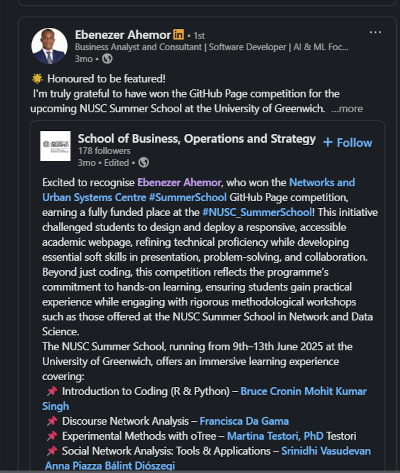

*This section provides evidence of my technical competence in learning technology implementation, configuration, and support.*

## Description

My technical expertise spans diverse learning technologies, demonstrated through the GenAI programme I co-developed and deliver with a colleague with extensive expertise in TEL and GenAI and a member of the GBS TEL WG. This comprehensive initiative comprises nine workshops reaching approximately 30 staff per session since February 2025, supported by a dedicated Microsoft Teams channel for ongoing collaboration and resource sharing.

*Microsoft Teams channel "GBS meets AI - Session Plan" facilitating ongoing collaboration, resource sharing, and technical support for the comprehensive GenAI programme across Greenwich Business School.*

The programme required deep technical understanding to address practical implementation. In "Local and Open-Source GenAI," I guide colleagues through distinctions between open and closed AI systems, demonstrating live deployment of alternatives like Mistral and Falcon models via cloud platforms and local installations, including hands-on demonstrations of LM Studio. The session explores how "open" encompasses multiple dimensions—from source code availability to training data transparency. I demonstrate practical options including cloud-based solutions and local deployment tools like Ollama and GPT4All, ensuring colleagues understand both technical capabilities and privacy implications.

*Workshop materials demonstrating practical options for accessing open GenAI models, including cloud-based solutions and local deployment tools, with emphasis on privacy implications and technical capabilities.*

The measurable impact demonstrates genuine technical capacity building. Pre- and post-session evaluations reveal substantial knowledge transformation: participants' understanding of open versus closed AI improved from 2.6 to 3.9, whilst their ability to access open tools increased from 2.6 to 4.3 on a 5-point scale.

*Pre-workshop evaluation data showing baseline knowledge levels for open vs closed AI understanding (2.6/5) and ability to access open tools (2.6/5).*

*Post-workshop evaluation data demonstrating significant improvement in understanding open vs closed AI (3.9/5) and practical tool access skills (4.3/5).*

My "Teaching Statistics and Quantitative Methods with GenAI" session showcases technical integration of AI tools with discipline-specific software. I demonstrate live how free-tier chatbots (ChatGPT, Claude, Copilot, Gemini) handle statistical computations, from basic descriptive statistics to complex regression analyses. The workshop includes hands-on exercises where participants experience AI's capabilities in generating R and Python code, whilst understanding limitations around computational accuracy and the need for verification. 

The workshop includes hands-on exercises where participants experience AI's capabilities in generating R and Python code, whilst understanding limitations around computational accuracy and the need for verification. Pre- and post-session evaluations demonstrate significant impact: participants' understanding of GenAI capabilities for statistics learning improved from 2.5 to 4.0, knowledge of integration strategies increased from 1.6 to 4.0, whilst their commitment to practical implementation averaged 3.0, indicating participants identified at least one new action to implement. This technical depth and measurable knowledge transformation enables colleagues to make informed decisions about integrating these tools into their quantitative methods teaching.

*Pre-workshop evaluation showing baseline understanding of GenAI capabilities for statistics learning (2.5/5) and knowledge of integration strategies (1.6/5).*

*Post-workshop evaluation demonstrating dramatic improvement in understanding GenAI capabilities (4.0/5) and integration strategies (4.0/5) for statistics teaching, with participants averaging 3.0/5 for commitment to implementing at least one new action in their practice.*

### Web Development and Student Mentoring

My technical expertise extends to web development, demonstrated through the [NUSC Summer School Website Challenge](https://sway.cloud.microsoft/10S9qG488dSz0E9d). I created a comprehensive competition brief published as a Sway page, outlining technical requirements including GitHub Pages deployment, responsive design, accessibility standards, and integration with workshop repositories. Working with the MSc Business Analytics Programme Lead as second reviewer, I evaluated student submissions based on technical implementation, user experience, and code quality.

The submissions revealed interesting contrasts between competition requirements and student interpretations. Despite guidelines suggesting Jekyll or other static site generators, all participants submitted straightforward HTML/CSS/JavaScript prototypes. While these lacked technical sophistication, they demonstrated creativity and understanding of core web fundamentals. The winning student's clean design and functional JavaScript countdown timer showed promise, making it the ideal foundation for collaborative development.

After selecting their submission, I invited the student as a collaborator to the [repository for the NUSC summer school webpage] (https://github.com/Networks-and-Urban-Systems-Centre-NUSC/summer-school) part of the NUSC GitHub organisation I manage. Our mentoring followed a structured approach: I met with them online to explain the gap between their prototype and production requirements. During these sessions, I outlined specific improvements needed—Open Graph meta tags for social sharing, responsive venue information, dynamic content updates, and enhanced navigation structure. I then guided them through implementing some changes themselves, such as updating the countdown functionality and refining the responsive layout.

*NUSC Summer School webpage GitHub repository showing collaborators*

For more complex technical requirements, I demonstrated implementation through direct commits, showing them how to structure semantic HTML, organise CSS for maintainability, and handle edge cases in JavaScript. In our final mentoring sessions, I introduced accessibility enhancements as a way to level up their skills—discussing the implementation of proper alt text for images, skip navigation links for keyboard users, and ARIA labels for improved screen reader support. While the student engaged enthusiastically with these concepts, the time constraints before the summer school meant these accessibility improvements weren't implemented in the initial launch version.

By June 2025, the [live website](https://networks-and-urban-systems-centre-nusc.github.io/summer-school) successfully served the summer school's needs, with my ongoing maintenance ensuring accuracy of dates, venues, and registration links.

*Live NUSC Summer School website demonstrating successful transformation from student prototype to professional institutional resource, showcasing responsive design, clear navigation, and functional countdown timer. Click to visit the live site.*

The student's pride in the collaborative outcome was evident in their LinkedIn post celebrating the competition win and collaborative development process.

*LinkedIn post from Ebenezer Ahemor celebrating the collaborative website development process, demonstrating the mentoring impact and professional recognition of the technical collaboration.*

The student reflected:

> "I collaborated with Dr Guido Conaldi to refine the site's usability and accessibility, improving navigation flow, readability, and responsiveness to ensure an inclusive user experience. I really enjoyed working with him on this project."

## Reflection

The measurable impact of my technical implementations validates the importance of evidence-based practice. In the GenAI workshops, systematic pre- and post-session evaluations reveal substantial knowledge transformation across multiple technical competencies. These metrics matter because they demonstrate genuine capacity building rather than superficial exposure. When colleagues report having "at least one new action to implement" (scoring 3.0), it indicates practical application beyond theoretical understanding. One participant noted they now use AI to "write or double-check R codes for statistical analyses," whilst another reported "getting better in Python because I dissect the code AI is producing for me, including errors and debugging."

The technical depth required for these sessions challenged my own expertise. Explaining why LLaMA isn't truly open-source despite Meta's marketing required understanding licensing nuances and architectural transparency. Similarly, demonstrating statistical applications meant anticipating where AI tools fail—such as complex matrix operations or specialised statistical tests—and preparing alternative approaches. This ongoing technical learning ensures my workshops provide accurate, nuanced guidance rather than superficial overviews.

The NUSC website challenge reinforced several technical mentoring principles that have shaped my approach to supporting student technical development. First, authentic assessment specifications don't guarantee technical implementation choices—students will use familiar tools rather than suggested technologies. This taught me to design assessments that accommodate different technical approaches whilst maintaining quality standards. The diversity of student approaches actually enriched the evaluation process, demonstrating creativity within technical constraints.

Second, the scaffolded mentoring approach—explaining requirements, guiding initial attempts, then demonstrating advanced techniques—proved more effective than prescriptive instruction. The student could see their original vision evolve into a professional institutional website while understanding each technical decision. This collaborative approach maintained their ownership of the project whilst introducing professional development practices they could apply in future work.

The accessibility discussions, though not implemented due to time constraints, reinforced an important mentoring insight: knowing when to prioritise functional delivery over perfect implementation. These conversations planted seeds for the student's future development, demonstrating how authentic assessment can introduce advanced concepts even when implementation timelines don't permit their immediate application. The student's enthusiasm for accessibility concepts suggests these discussions will influence their future technical work, extending the mentoring impact beyond the immediate project.

The collaborative GitHub workflow provided practical experience with version control, code review, and professional development practices that complement the technical skills. By inviting the student as a collaborator rather than simply commissioning work, I modelled how technical projects function in professional environments, preparing them for workplace collaboration patterns they'll encounter in their career.

---

*Navigation: [← Core Area 1a](/core-area-1a/) | [Core Area 2a →](/core-area-2a/)*