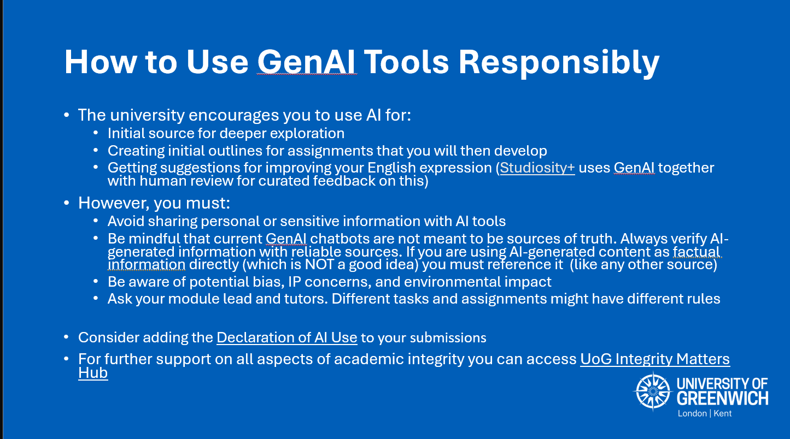
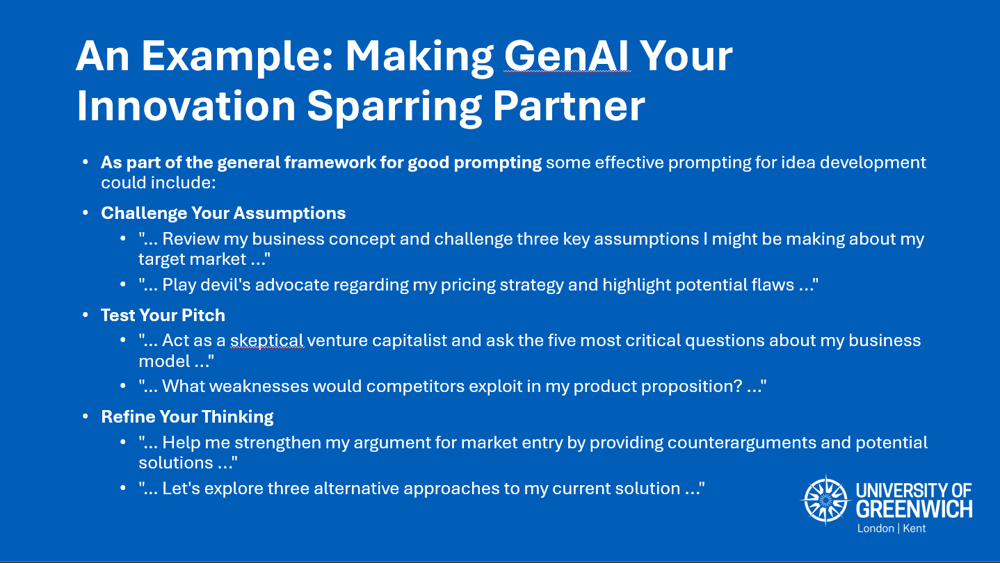
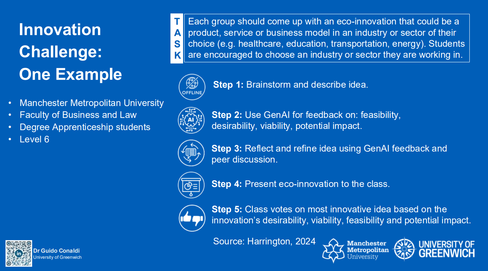

*This section demonstrates my understanding of how educational technology supports and enhances teaching, learning, and assessment processes.*

## Description

My understanding of teaching, learning, and assessment processes is exemplified through the AI-Enhanced Business Innovation Challenge, a pedagogical framework I developed to transform GenAI from a passive tool into an active learning partner. This initiative, delivered across multiple programmes at Greenwich Business School, demonstrates how social constructivist principles can guide meaningful AI integration in higher education.

The Innovation Challenge emerged from recognising that students' engagement with GenAI often remains superficial and individualistic. Drawing on constructivist learning theory (Adams, 2006) and recent research on collaborative AI learning (Lodge et al., 2023; Zhou & Schofield, 2024), I designed structured experiences that position GenAI as a partner in collective knowledge construction rather than a shortcut to task completion.

The pedagogical design incorporates four interconnected principles. First, **Structured GenAI Integration** provides clear frameworks for appropriate AI use, allowing students to develop technological competence whilst maintaining focus on active knowledge construction. Second, **Collaborative Problem-Solving** requires teams to engage in authentic tasks that demand collective negotiation of knowledge, encouraging dialogue and critical engagement with both GenAI outputs and peer perspectives. Third, **Active Knowledge Construction** scaffolds students' ability to work effectively with GenAI, progressing from basic interactions to sophisticated collaborative partnerships. Finally, **Collective Evaluation** incorporates built-in reflection opportunities that develop metacognitive awareness of how students learn with GenAI.

### Implementation Across Multiple Programmes

I have delivered the Innovation Challenge in multiple formats to accommodate different programme needs. The Quick Sprint (90-120 minutes in-class) suits modules with limited contact time, whilst the Extended Quest (week-long hybrid with in-class start) allows deeper engagement. Sessions have been successfully integrated into MSc Business Analytics (3 sessions across Term 1 cohort), BA Entrepreneurship and Innovation (both level 4 and level 6), BA Business Management and Leadership (level 4), and a specialised Masterclass Event attended by 100 undergraduate students.

Each session begins with a comprehensive 30-45 minute introduction I deliver on responsible and effective GenAI use. The responsible use component covers university guidelines, privacy considerations, intellectual property concerns, and critical consumption of AI-generated content. I emphasise that responsible use goes beyond compliance—it requires understanding how data is processed, who owns generated content, and the environmental impact of AI consumption.

*Workshop materials on responsible GenAI use covering university guidelines, privacy considerations, and critical consumption of AI-generated content.*

For effective use, I teach [Google's five-step prompting framework](https://cloud.google.com/discover/what-is-prompt-engineering), which provides students with a structured approach to engaging with GenAI: defining the task, providing context, stating requirements, including examples, and iterating based on outputs. This framework transforms random experimentation into systematic engagement.

*Workshop materials demonstrating practical GenAI prompting strategies for innovation development that transform GenAI from passive tool into active innovation sparring partner.*

Following this foundation, students work in teams on authentic business challenges—several developed with industry partners—relevant to their programme content. For instance, MSc Business Analytics students tackle data-driven market entry strategies, whilst BA Entrepreneurship students develop AI-enhanced startup pitches. Throughout the challenge, I facilitate rather than instruct, encouraging teams to discover effective AI collaboration strategies through guided experimentation grounded in the frameworks introduced. Teams then present their solutions as pitches, with peers voting on the most innovative proposals, adding a gamified competitive element that encourages active engagement whilst promoting transparency in AI use through group accountability.

*Innovation Challenge five-step framework showing structured approach from brainstorming to peer voting on most innovative ideas from the Advance HE AI Symposium 2025 presentation.*

### Assessment Design and Authentic Practice

The assessment design reflects authentic practice. Rather than evaluating AI outputs directly, I assess teams' critical engagement with AI-generated content, their collaborative processes, and their ability to synthesise human insight with AI capabilities. Teams present their solutions, explaining not just what they created but how they worked with AI to achieve it. This approach shifts focus from AI competency to collaborative learning competency, preparing students for professional environments where human-AI collaboration is increasingly common.

To understand impact and refine the approach, I collaborated with a colleague from Manchester Metropolitan University on a mixed-methods investigation spanning three higher education institutions. We collected pre- and post-challenge questionnaires (n=67), anonymous group reflections, and are conducting semi-structured interviews. This research collaboration led to presenting our findings at the [Advance HE AI Symposium 2025](https://www.advance-he.ac.uk/programmes-events/calendar/artificial-intelligence-symposium-2025), where we shared insights on transforming GenAI into an active learning partner through experiential education.

Early findings reveal extensive GenAI usage in knowledge construction: 50.7% of students used AI for developing initial ideas, 46.3% for refining group thinking, and 41.8% for challenging group assumptions. Team learning impact proved significant, with 61.2% building shared understanding, 56.7% challenging existing assumptions, and 55.2% developing new collaborative skills. Regarding collaborative patterns, 31.3% of teams engaged collectively with GenAI, whilst others adopted mixed approaches (20.9%), individual member strategies (19.4%), or designated AI leads (11.9%), demonstrating diverse collaboration patterns emerging organically.

### Institutional Recognition and Scaling

The institutional recognition of this approach validates its broader applicability. The University Student Success Board flagged the Innovation Challenge in June 2025 as a model to be developed for adoption across all faculties. By creating structured experiences with clear learning outcomes, the Innovation Challenge has also provided a framework that colleagues can adapt for their contexts, contributing to faculty-wide discussions through the GBS TEL Working Group about developing shared resources for wider implementation. For the 2025-26 academic year, the faculty has indeed asked the GBS TEL Working Group to package these shared resources for wider faculty adoption.

The broader institutional impact of my contribution had been already previously recognised by the University TEL Lead:

> "Dr. Guido Conaldi has made an instrumental and impactful contribution to shaping institutional TEL priorities, driving the digital-sub strategy 2030 goals... Without him, realizing rapid change in learning technologies would be challenging."

## Reflection

The Innovation Challenge demonstrates how pedagogical frameworks can transform potentially disruptive technologies into powerful learning tools when grounded in established educational theory. The social constructivist foundation proves particularly relevant because GenAI amplifies the importance of collective sense-making rather than individual knowledge acquisition. When students work together to interpret and build upon AI-generated content, they engage in the kind of collaborative knowledge construction that constructivist theory suggests leads to deeper learning.

The diversity of collaborative patterns that emerged organically provides insight into how students naturally adapt to human-AI collaboration when given appropriate scaffolding. Teams developed different approaches—some engaging collectively with GenAI, others designating AI leads, or adopting mixed strategies based on task requirements. This variation indicates that effective pedagogy can accommodate different learning styles whilst maintaining core educational objectives, becoming particularly important as institutions seek scalable approaches that work across different programmes and student cohorts.

The institutional recognition of this approach validates its broader applicability. The University Student Success Board endorsement reflects both the pressing need for structured AI education and the effectiveness of combining clear frameworks for responsible use with hands-on collaborative challenges. The 30-45 minute introductory session has proven particularly valuable—students consistently report that understanding both the "why" of responsible use and the "how" of effective prompting transforms their subsequent engagement with AI tools.

The assessment strategy evolution reflects growing understanding of what we should evaluate in AI-enhanced learning. Initially focused on outputs, I shifted emphasis to processes—how teams engaged with AI-generated content, negotiated different perspectives, and synthesised human and artificial insights. This change recognises that in professional contexts, the ability to collaborate effectively with AI systems matters more than the specific content any individual AI interaction produces.

One unexpected learning concerned the importance of explicit instruction in AI engagement strategies. Students who received structured frameworks for prompting and critical evaluation demonstrated more sophisticated collaborative behaviours than those who relied on intuitive approaches. This suggests that whilst digital natives may be comfortable with technology generally, effective AI collaboration requires specific pedagogical support—a finding with implications for curriculum design across higher education.

The Google five-step prompting framework, whilst relatively basic in its structure, has proven particularly effective for the time-constrained format of the Innovation Challenges. Its simplicity allows students to grasp the fundamentals quickly within the 30-45 minute introduction, yet provides sufficient structure to transform their subsequent AI interactions from random experimentation into purposeful collaboration. This experience reinforced that pedagogical frameworks need not be complex to be effective, particularly when working within the practical constraints of diverse programme schedules.

The institutional impact demonstrates how well-designed pedagogical innovations can influence broader educational culture. Faculty colleagues who observed Innovation Challenge sessions have begun requesting support in adapting the approach for their modules, leading to GBS TEL Working Group discussions about developing shared resources. This organic adoption suggests that when innovations demonstrate clear pedagogical value whilst remaining practical to implement, they can drive institutional change without requiring top-down mandates.

By positioning AI as a learning partner rather than a tool, we create opportunities for students to develop not just AI literacy but collaborative learning competencies essential for their future careers. This work continues to evolve, with plans for virtual challenge formats and expanded research collaboration, but the core insight remains: effective technology-enhanced learning emerges from sound pedagogical principles, not technological capabilities.

## References

Adams, P. (2006). Exploring social constructivism: Theories and practicalities. *Education 3-13*, 34(3), 243–257. https://doi.org/10.1080/03004270600898893

Harrington, J. (2024) 'Student-centric approaches to the university of the future', in Cook, M.C. (ed.) *Technology foundations for twenty-first century higher education*. HEPI Report, 172, p. 56\.

Lodge, J. M., Barba, P. de, & Broadbent, J. (2023). Learning with Generative Artificial Intelligence Within a Network of Co-Regulation. *Journal of University Teaching and Learning Practice*, 20(7), Article 7\. https://doi.org/10.53761/1.20.7.02

Rasul, T., Nair, S., Kalendra, D., Robin, M., Santini, F. de O., Ladeira, W. J., Sun, M., Day, I., Rather, R. A., & Heathcote, L. (2023). The role of ChatGPT in higher education: Benefits, challenges, and future research directions. *Journal of Applied Learning and Teaching*, 6(1), Article 1\. https://doi.org/10.37074/jalt.2023.6.1.29

Zhou, X., & Schofield, L. (2024). Using social learning theories to explore the role of generative Artificial Intelligence (AI) in collaborative learning. *Journal of Learning Development in Higher Education*, 30, Article 30\. https://doi.org/10.47408/jldhe.vi30.1031

---

*Navigation: [← Core Area 1b](/core-area-1b/) | [Core Area 3a →](/core-area-3a/)*