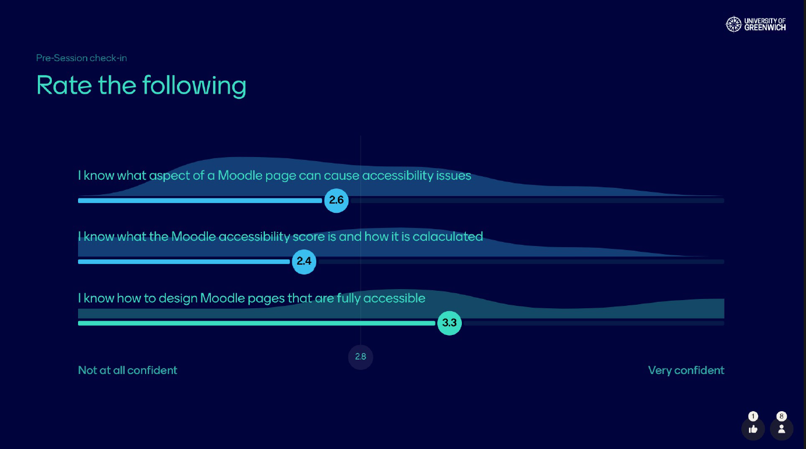
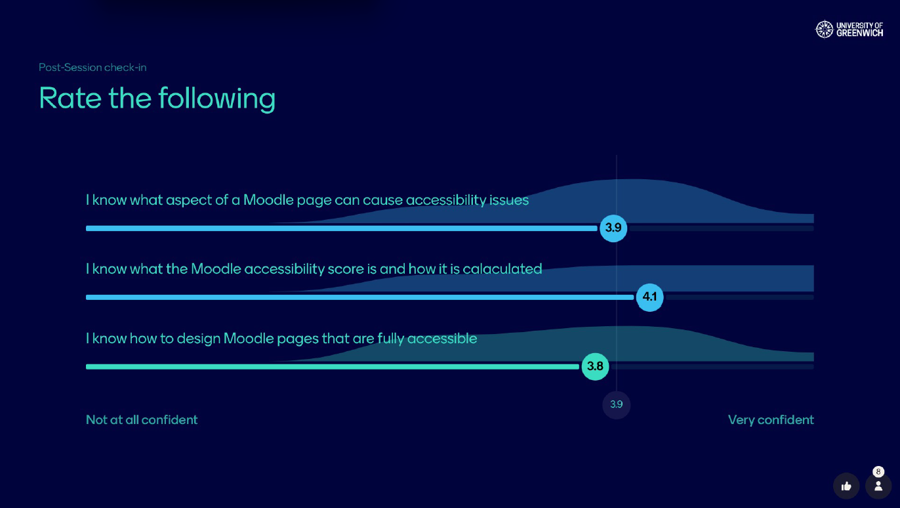
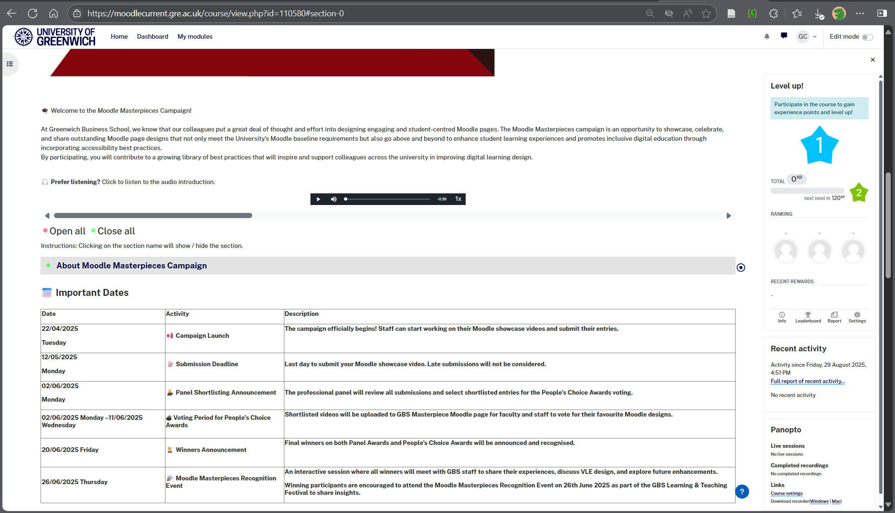
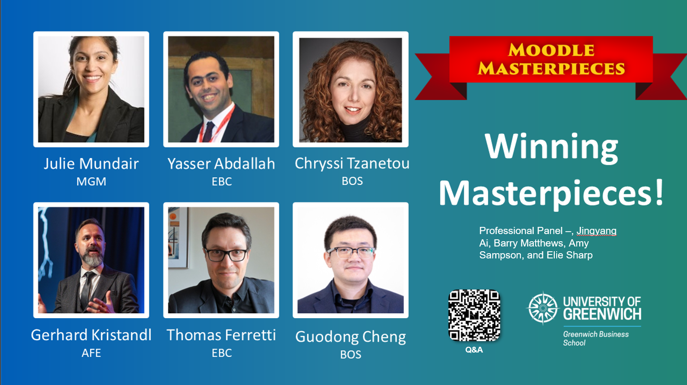
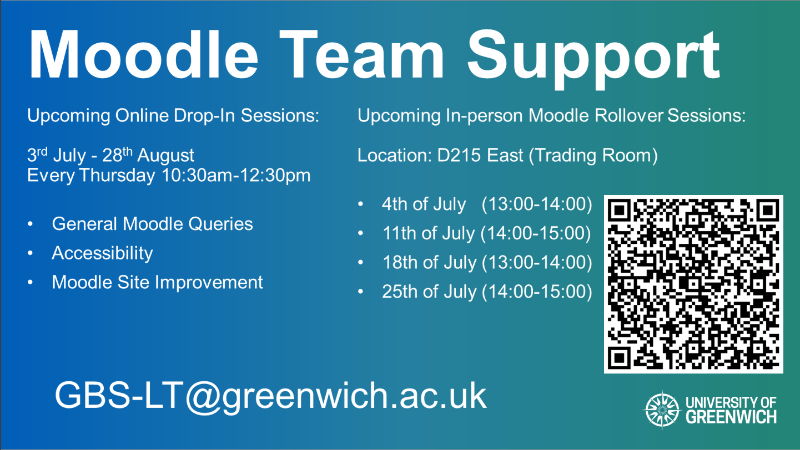

*This section demonstrates my understanding of legal frameworks, policies, and ethical considerations that affect educational technology practice.*

## Description

My understanding of educational legislation fundamentally shapes how I approach technology implementation at institutional scale. This comprehensive engagement spans GDPR compliance, accessibility legislation, and emerging AI regulation, demonstrating how deep legislative understanding drives both innovation and institutional compliance.

### GDPR and Institutional Policy Integration

The General Data Protection Regulation provides the framework for my approach to educational technology selection and implementation. In developing our faculty's GenAI programme, I recognised that GDPR compliance required careful integration of both legal requirements and university policy frameworks. The University of Greenwich's commitment to responsible AI use provides the institutional foundation for my approach to colleague and student education.

My response has been to support institutional policy implementation through systematic education and compliant alternatives. In every GenAI workshop (detailed in [section 1b](/core-area-1b/)), I dedicate substantial time to explaining both GDPR implications and university guidelines for responsible AI use, ensuring colleagues understand how to align their practice with institutional expectations. Commercial AI platforms like ChatGPT and Claude process user inputs on servers outside the UK, creating potential violations of both GDPR and institutional data policies when colleagues unknowingly share personal data, confidential research, or sensitive institutional information through their prompts.

This legislative and policy understanding shaped my advocacy for local and open-source AI alternatives. In the "Local and Open-Source GenAI" workshop (technical details in [section 1b](/core-area-1b/)), I frame tools like Ollama and GPT4All not merely as technical alternatives but as solutions that satisfy both GDPR requirements and university data governance policies. When demonstrating these tools, I explain how local processing ensures sensitive student data, unpublished research, or confidential business information never leaves institutional control, transforming compliance from barrier to pedagogical advantage.

For students, this integration proves equally important. In each 30-45 minute introduction during our Innovation Challenge sessions (described in [section 2a](/core-area-2a/)), I combine university guidelines with GDPR education. Students learn that when they use commercial AI tools, they benefit from systems trained on others' intellectual property whilst potentially sharing personal data without clear consent mechanisms. This awareness helps them understand the importance of university responsible use guidelines and why data protection matters in their professional development. By connecting institutional policies to broader legal frameworks, students develop informed approaches to technology adoption whilst understanding how university guidance supports their academic and professional success.

### Accessibility Legislation: From Compliance to Culture Change

The Equality Act 2010 requires educational institutions to make reasonable adjustments to avoid discrimination against individuals with disabilities. As public sector bodies, UK universities are also legally required to comply with WCAG 2.1 Level AA under web accessibility regulations. My interpretation extends beyond minimum compliance—I view accessibility as a core design principle that enhances learning for all users. This legislative understanding has driven two distinct but connected initiatives over consecutive academic years.

#### 2023-24: Faculty-wide VLE Accessibility Enhancement Initiative

My systematic response to accessibility legislation began in 2023-24 with comprehensive VLE data analysis revealing significant accessibility gaps. Based on this baseline analysis, I led the Faculty-wide VLE Accessibility Enhancement Initiative, collaborating with the Students' Union Disabled Students Liberation Chair and university Wellbeing Team to design targeted interventions that moved beyond technical compliance to meaningful inclusive practice.

This initiative involved designing and delivering CPD workshops and one-to-one support sessions that framed accessibility not as legal obligation but as pedagogical enhancement. Previous accessibility training sessions had suffered from poor attendance, requiring a fundamental shift in approach and communication strategy.

Working closely with the Faculty Learning Technologies Team, I coached the team on how to structure these sessions more effectively and communicate with academic staff in ways that emphasised pedagogical benefits rather than compliance burdens. This involved teaching the team to position accessibility features—such as proper heading structures, alt text, and colour contrast ratios—as serving pedagogical as well as legal purposes.

I personally approached colleagues individually based on their Blackboard Ally accessibility scores, recognising that whilst this Moodle plugin provides valuable baseline data, it has inherent limitations in capturing the full accessibility landscape. When one colleague raised concerns about the tool's constraints during our conversation, I engaged constructively with these critiques whilst maintaining focus on the broader importance of inclusive design principles.

This approach proved effective in generating genuine interest in TEL development beyond mere compliance, with this colleague subsequently joining the TEL Working Group specifically to help broaden our faculty's approach to accessibility enhancement. My method demonstrated that acknowledging technical limitations whilst emphasising pedagogical benefits creates more sustainable engagement than purely compliance-driven approaches.

The measurable impact validated this approach: reaching 48 colleagues across targeted CPD and support sessions, with over 80% of module leaders identified with accessibility issues implementing improvements to their VLE pages. Pre- and post-session evaluations demonstrated significant improvement in staff confidence around accessibility implementation, increasing from 2.8/5 to 3.9/5.

*Pre-session accessibility training evaluation showing baseline staff confidence levels at 2.8/5 across key accessibility knowledge areas including understanding accessibility issues, Moodle accessibility scores, and designing fully accessible pages.*

*Post-session accessibility training evaluation demonstrating significant improvement in staff confidence levels to 3.9/5, validating the effectiveness of framing accessibility as pedagogical enhancement rather than compliance requirement.*

The effectiveness of framing accessibility as pedagogical enhancement was evident in participant feedback, with one colleague noting:

> "This training was really useful [...] it addressed many questions I had. I reached out to the Inclusivity consultants to get my module audited."

This foundation work established accessibility as pedagogical priority rather than compliance checkbox.

#### 2024-25: Moodle Masterpieces Campaign Integration

Building on this foundation, I engaged with the Moodle Masterpieces campaign in 2024-25—an initiative developed by a GBS TEL Working Group member and a learning technologist to showcase excellence in virtual learning environment design. Rather than treating accessibility as a separate consideration, I worked to make accessibility principles central to the entire campaign framework, arguing that accessible design is fundamentally good design.

My contribution proved central to the campaign's development: I secured funding for the prizes, helped design the evaluation criteria, and ensured accessibility considerations became intrinsic to recognising VLE excellence across all award categories. The campaign's success is documented through its dedicated website showcasing award-winning accessible designs.

*Moodle Masterpieces campaign website showing the systematic integration of accessibility principles throughout the campaign structure, timeline, and evaluation process.*

This approach demonstrated how legislative compliance enhances rather than constrains pedagogical creativity.

As Faculty TEL Tutor, I deliver an annual TEL Spotlight plenary session at the GBS Learning and Teaching Festival. For 2025, I strategically chose to dedicate this session to showcasing the Moodle Masterpieces campaign, particularly highlighting how accessibility integration drives pedagogical innovation. This decision gave maximum institutional visibility to the accessibility work, reaching the entire business school faculty through my presentation "Best Practices in Accessible and Engaging Moodle Design."

*TEL Spotlight presentation slide showing the six Moodle Masterpieces winners across different schools (MGM, EBC, BOS, AFE), demonstrating the success of embedding accessibility principles as core design excellence throughout the campaign.*

During the session, I also announced new one-to-one accessibility support sessions to be led by the Faculty Learning Technologies Team, extending the campaign's impact into ongoing professional development.

*TEL Spotlight presentation slide announcing "Moodle Team Support" including upcoming online drop-in sessions and in-person Moodle rollover sessions, showing how legislative compliance work was extended into systematic ongoing support structures.*

By demonstrating award-winning designs that integrated accessibility seamlessly, this presentation established legislative compliance as core component of our TEL innovation culture.

### Institutional Policy Development and Legislative Influence

My role on the University Learning Technologies Committee provides direct opportunities to influence institutional policy development within legislative frameworks. When Panopto lecture recording policies were discussed in 2023, I initiated consultation with the GSU Disabled Students Liberation Chair to understand how technical limitations affected disabled students' access to recorded content. This consultation revealed gaps between technical implementation and Equality Act compliance requirements.

To ensure disabled students' perspectives informed policy development, I reported these findings to the committee and worked to incorporate accessibility requirements into the policy framework. My input was subsequently incorporated into the policy report for discussion at Vice-Chancellor's Executive level, demonstrating how committee membership can influence institution-wide legislative compliance whilst ensuring lived experiences shape policy development.

## Reflection

Working at the intersection of legislation and innovation has fundamentally reshaped my understanding of compliance as creative opportunity rather than restrictive obligation. Initially, I viewed GDPR as limiting pedagogical possibilities with AI tools. However, deeper engagement revealed how privacy-focused alternatives like local AI tools actually enable more experimental applications whilst developing students' critical understanding of data sovereignty.

The chronological development of accessibility initiatives demonstrates how legislative understanding evolves practice over time. The 2023-24 targeted accessibility campaign established foundation knowledge and confidence among colleagues. This groundwork proved essential for the 2024-25 Moodle Masterpieces integration, where accessibility principles could be embedded naturally rather than imposed externally. This progression illustrates how sustained legislative engagement transforms institutional culture rather than merely achieving compliance. Throughout both initiatives, I consistently emphasised the pedagogical benefits of accessible design rather than reducing discussions to compliance requirements, helping colleagues understand accessibility as good practice that enhances learning for all students.

My Learning Technologies Committee involvement reinforced that effective policy emerges from combining legislative understanding with lived experiences of those most affected. The DSLC's insights about Panopto limitations provided concrete examples that abstract policy discussions often lack, ensuring that institutional responses addressed real barriers rather than theoretical compliance.

This legislative engagement has fundamentally shaped my TEL leadership approach. Understanding legislation deeply enough to find creative solutions within legal frameworks has become core competency, influencing programme design, tool selection, and colleague guidance through evolving educational technology law. Most importantly, this work demonstrates that compliance and innovation strengthen each other when legislative requirements are understood as enabling frameworks rather than restrictive barriers.

---

*Navigation: [← Core Area 2a](/core-area-2a/) | [Core Area 4a →](/core-area-4a/)*